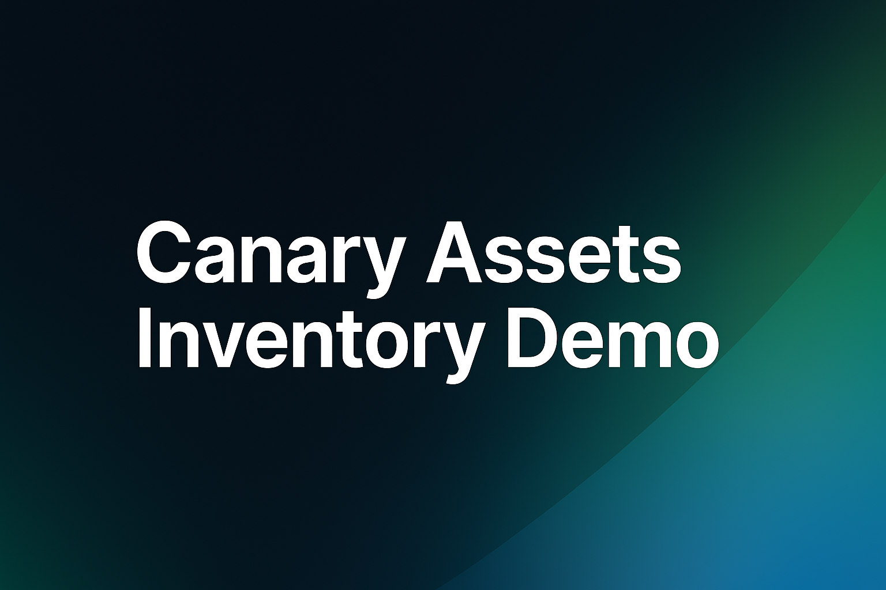
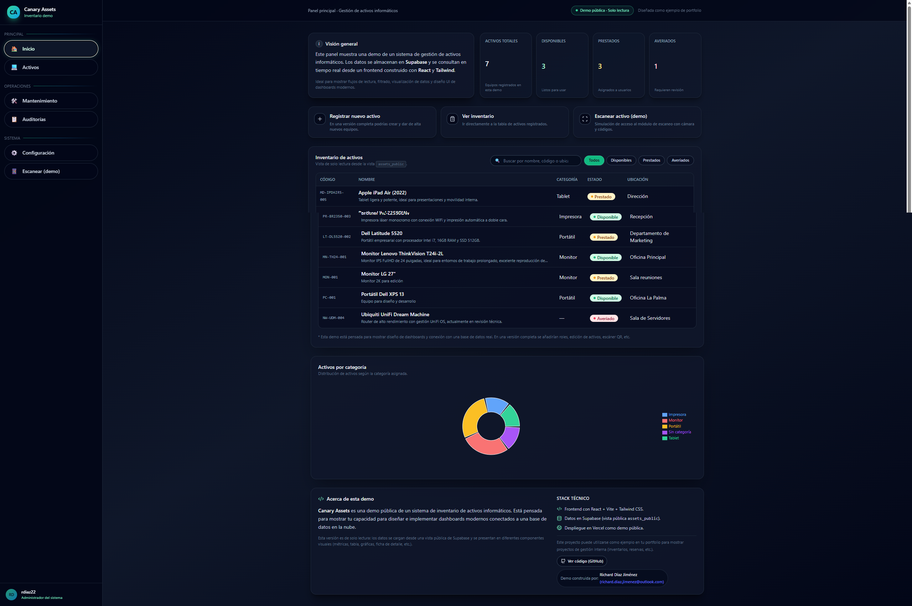
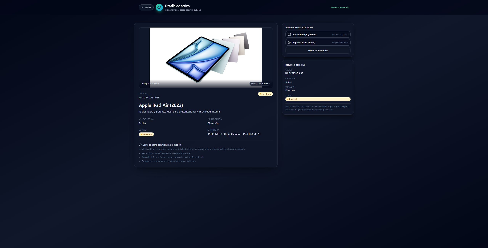

# Canary Assets · Demo pública


Canary Assets es una **demostración realista** de un sistema moderno de gestión de activos informáticos, desarrollada como proyecto de portfolio para mostrar:

✔ Diseño UI/UX estilo SaaS  
✔ Dashboard profesional  
✔ Tabla filtrable  
✔ Gráficas dinámicas  
✔ Detalle completo del activo  
✔ Integración real con **Supabase**  
✔ Despliegue en **Vercel**

---

## 🚀 Tech Stack

- **React + Vite**
- **Tailwind CSS** (UI moderna estilo Linear/Arc)
- **Supabase** (Base de datos + vistas públicas)
- **Lucide React** (Iconografía moderna)
- **Vercel** (Hosting / Deploy)

---

## 📸 Capturas

> (Aquí colocas tú las imágenes reales de tu demo)

| Dashboard | Detalle de Activo |
|----------|-------------------|
|  |  |

---

## 🎯 Funcionalidades principales

### **Dashboard**
- Métricas en tiempo real
- Tabla con filtros avanzados
- Búsqueda instantánea
- Estado del activo con badges de colores
- Gráfica por categorías

### **Vista de detalle**
- Foto grande del activo
- Ficha técnica
- Acciones rápidas (Ver QR, Imprimir ficha)
- Panel lateral de información
- Enlace directo para móvil (uso con QR)

### **Acciones rápidas**
- Ir al inventario con scroll suave
- Registrar nuevo activo (demo)
- Escaneo de activos (demo)

---

## 🗂 Datos de ejemplo

Se incluyen 7 activos reales con fotos:

- Monitores (Lenovo)
- Portátiles (Dell)
- Impresoras (Brother)
- Routers (Ubiquiti UDM)
- Tablets (iPad)
- Más equipos de oficina

> Los datos se cargan desde `assets_public`, una vista de solo lectura en Supabase.

---

## 🔧 Cómo ejecutar en local

```bash
npm install
npm run dev

